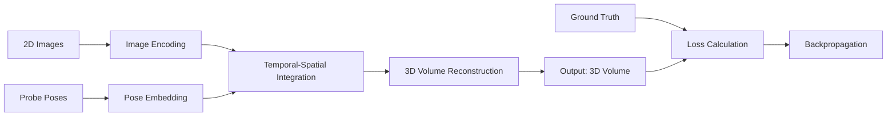
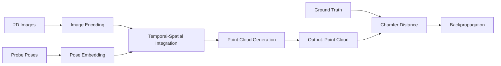
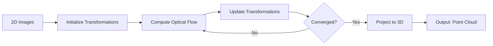
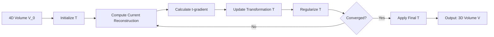
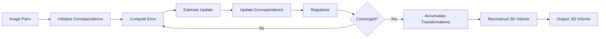
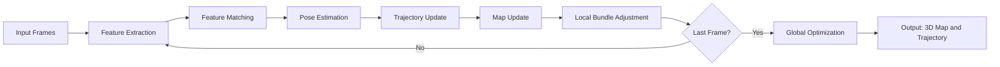
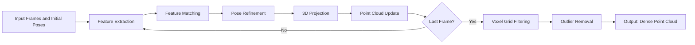
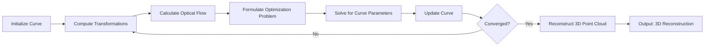
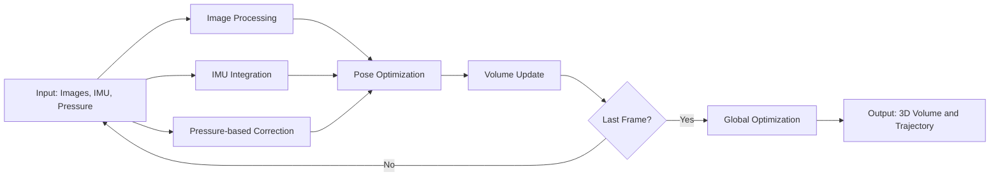

# Comprehensive Compendium of 3D Ultrasound Reconstruction Approaches

## Notation and Definitions

- $I(t): [0, T] \to \mathbb{R}^{H \times W}$: 2D grayscale ultrasound image function
- $P(t): [0, T] \to SE(3)$: probe pose function
- $\{(I_i, P_i)\}_{i=1}^N$: discrete set of image-pose pairs
- $\Omega \subset \mathbb{R}^3$: 3D reconstruction space
- $V: \Omega \to \mathbb{R}$: reconstructed 3D volume
- $\mathcal{P} = \{(x, y, z, i) | (x, y, z) \in \mathbb{R}^3, i \in \mathbb{R}\}$: point cloud space

## Approach 1: Neural Operator for 3D Volume Reconstruction

### Formulation

$\mathcal{G}: (L^2([0, T]; \mathbb{R}^{H \times W}) \times C([0, T]; SE(3))) \to L^2(\Omega; \mathbb{R})$

such that $\mathcal{G}(I, P) = V$, where $V: \Omega \to \mathbb{R}$ is the reconstructed 3D volume.

### Algorithm

1. Define neural networks:

   - $\mathcal{E}: \mathbb{R}^{H \times W} \to \mathbb{R}^d$ (image encoder)
   - $\mathcal{Q}: SE(3) \to \mathbb{R}^d$ (pose embedder)
   - $\mathcal{F}: (\mathbb{R}^d \times \mathbb{R}^d)^N \to L^2(\Omega; \mathbb{R})$ (integrator)

2. For each $(I_i, P_i)$ pair:
   a. Compute $E_i = \mathcal{E}(I_i)$
   b. Compute $Q_i = \mathcal{Q}(P_i)$

3. Integrate: $V = \mathcal{F}(\{E_i, Q_i\}_{i=1}^N)$

4. Define loss: $\mathcal{L} = \alpha \|V - V_{gt}\|_2^2 + \beta (1 - \text{SSIM}(V, V_{gt}))$

5. Train using gradient descent:
   $\theta \leftarrow \theta - \eta \nabla_\theta \mathcal{L}$

### Mermaid Chart



## Approach 2: Neural Operator for Point Cloud Reconstruction

### Formulation

$\mathcal{G}: (L^2([0, T]; \mathbb{R}^{H \times W}) \times C([0, T]; SE(3))) \to \mathcal{P}$

### Algorithm

1. Define neural networks:

   - $\mathcal{E}: \mathbb{R}^{H \times W} \to \mathbb{R}^d$ (image encoder)
   - $\mathcal{Q}: SE(3) \to \mathbb{R}^d$ (pose embedder)
   - $\mathcal{F}: (\mathbb{R}^d \times \mathbb{R}^d)^N \to \mathcal{P}$ (point cloud generator)

2. For each $(I_i, P_i)$ pair:
   a. Compute $E_i = \mathcal{E}(I_i)$
   b. Compute $Q_i = \mathcal{Q}(P_i)$

3. Generate point cloud: $\{(x_k, y_k, z_k, i_k)\}_{k=1}^K = \mathcal{F}(\{E_i, Q_i\}_{i=1}^N)$

4. Define loss: $\mathcal{L} = d_{Chamfer}(\{(x_k, y_k, z_k, i_k)\}, \{(x_k^{gt}, y_k^{gt}, z_k^{gt}, i_k^{gt})\})$

5. Train using gradient descent:
   $\theta \leftarrow \theta - \eta \nabla_\theta \mathcal{L}$

### Mermaid Chart



## Approach 3: Optical Flow Minimization for Frame Alignment

### Formulation

Find $\{T_i\}_{i=1}^N$, where $T_i \in SE(3)$, such that:

$\arg\min_{\{T_i\}} \sum_{i=1}^{N-1} \|\text{OpticalFlow}(I_i \circ T_i, I_{i+1} \circ T_{i+1})\|_2^2$

subject to $T_1 = I$ (identity transformation)

### Algorithm

1. Initialize $\{T_i\}_{i=1}^N$ as identity transformations
2. For each iteration (max*iter):
   a. For $i = 1$ to $N-1$:
   i. Compute optical flow: $F_i = \text{OpticalFlow}(I_i \circ T_i, I*{i+1} \circ T*{i+1})$
      ii. Estimate $\Delta T_i$ from $F_i$ using least squares
   iii. Update $T_i \leftarrow T_i \circ \Delta T_i$
   b. Compute loss: $\mathcal{L} = \sum*{i=1}^{N-1} \|F_i\|\_2^2$
   c. If $\mathcal{L} < \epsilon$ or iteration > max_iter, break
3. Reconstruct 3D points:
   For each pixel $(u, v)$ in each image $I_i$:
   a. Back-project to 3D: $(x, y, z) = T_i^{-1} K^{-1} (u, v, 1)$
   b. Add $(x, y, z, I_i(u, v))$ to point cloud

Where $K$ is the camera intrinsic matrix.

### Mermaid Chart



## Approach 4: Skewer-to-Curve Transformation

### Formulation

Define $S(s) = (0, 0, sL)$, $s \in [0, 1]$, $L$ is skewer length.
Find $C(s): [0, 1] \to \mathbb{R}^3$ such that $C(s) = (x(s), y(s), z(s))$

### Constraints

1. $C(0) = (0, 0, 0)$ and $C(1) = (x_f, y_f, L)$
2. $\|C'(s)\| \approx L$ for all $s$
3. Minimize $\sum_{i=1}^{N-1} \|\text{OpticalFlow}(I_i \circ T(s_i), I_{i+1} \circ T(s_{i+1}))\|_2^2$

### Algorithm

1. Initialize $C(s) = S(s)$
2. For each iteration (max*iter):
   a. Compute transformations: $T(s_i) = C(s_i) \circ S(s_i)^{-1}$, $s_i = i/(N-1)$
   b. Calculate optical flow: $F_i = \text{OpticalFlow}(I_i \circ T(s_i), I*{i+1} \circ T(s*{i+1}))$
   c. Update $C(s)$:
   i. Represent $C(s) = \sum*{k=1}^K \alpha_k \phi_k(s)$, where $\phi_k$ are basis functions
   ii. Solve for $\{\alpha_k\}$ to minimize $\sum \|F_i\|^2$ subject to constraints
   d. If change in $C(s)$ < $\epsilon$ or iteration > max_iter, break
3. Final reconstruction:
   For each pixel $(u, v)$ in each image $I_i$:
   a. Compute $s_i = i/(N-1)$
   b. Back-project to 3D: $(x, y, z) = T(s_i)^{-1} K^{-1} (u, v, 1)$
   c. Add $(x, y, z, I_i(u, v))$ to point cloud

### Mermaid Chart

```mermaid
    graph LR
    A[2D Image Sequence] --> B[Initialize Straight Skewer]
    B --> C[Compute Frame Transformations]
    C --> D[Calculate Optical Flow]
    D --> E[Update Curve C(s)]
    E --> F{Converged?}
    F -->|No| C
    F -->|Yes| G[Project Frames onto Curve]
    G --> H[Output: 3D Reconstruction]
```

## Approach 5: Time as a Spatial Dimension

### Formulation

Let $V_0: \Omega_4 \to \mathbb{R}$ be the initial 4D volume.
Find $T: \Omega_4 \to \Omega_3$ such that $V(T(x, y, z, t)) = V_0(x, y, z, t)$

### Constraints

1. $T$ is a diffeomorphism
2. Minimize variation of $V$ along original $t$ direction
3. Well-conditioned Jacobian of $T$

### Algorithm

1. Initialize $T_0(x, y, z, t) = (x, y, z)$
2. For each iteration (max*iter):
   a. Compute current reconstruction: $V_k(x, y, z) = V_0(T_k^{-1}(x, y, z))$
   b. Calculate t-gradient: $G_k = \nabla_t V_k \circ T_k^{-1}$
   c. Update T: $T*{k+1} = T*k - \lambda G_k$
   d. Regularize $T*{k+1}$:
      i. Smooth: $T_{k+1} = T_{k+1} * \text{GaussianKernel}$
   ii. Enforce invertibility: $\det(\nabla T_{k+1}) > \epsilon$
   e. If $\|T_{k+1} - T_k\| < \delta$ or iteration > max_iter, break
3. Final reconstruction: $V(x, y, z) = V_0(T^{-1}(x, y, z))$

### Mermaid Chart



## Approach 6: Dense Matching for Ultrasound Frames

### Formulation

For each pair $(I_i, I_{i+1})$, find $F_i: \mathbb{R}^2 \to \mathbb{R}^2$ such that:
$I_i(x, y) \approx I_{i+1}(F_i(x, y))$ for all $(x, y)$

### Algorithm

1. For each pair $(I_i, I_{i+1})$:
   a. Initialize $F_i(x, y) = (x, y)$
   b. For iteration = 1 to max*iter:
   i. Compute error: $E_i(x, y) = I_i(x, y) - I*{i+1}(F*i(x, y))$
   ii. Estimate update: $\Delta F_i = \text{NCC}(E_i, I*{i+1})$
      iii. Update: $F_i(x, y) \leftarrow F_i(x, y) + \lambda \Delta F_i(x, y)$
   iv. Regularize: $F_i = \text{BilateralFilter}(F_i)$
   v. If $\|\Delta F_i\| < \epsilon$, break
2. Accumulate: $T_i = F_1 \circ F_2 \circ ... \circ F_{i-1}$
3. Reconstruct:
   For each voxel $(x, y, z)$ in $V$:
   a. Find $i$ such that $z \in [i\Delta z, (i+1)\Delta z]$
   b. Compute $(x', y') = T_i^{-1}(x, y)$
   c. Set $V(x, y, z) = I_i(x', y')$

Where NCC is Normalized Cross-Correlation.

### Mermaid Chart



## Approach 7: Visual SLAM Inspired Reconstruction

### Formulation

Simultaneously estimate:

1. Map $M: \Omega \to \mathbb{R}$ (3D tissue structure)
2. Trajectory $\tau: [0, T] \to SE(3)$ (probe poses)

Optimize $\arg\min_{M, \tau} \sum_{i=1}^N \|I_i - \text{Proj}(M, \tau(t_i))\|^2 + \lambda R(M, \tau)$

Where $\text{Proj}$ is the projection function and $R$ is a regularization term.

### Algorithm

1. Initialize $M_0$ as empty map, $\tau_0$ as identity trajectory
2. For each frame $I_i$, $i = 1$ to $N$:
   a. Feature extraction: $F_i = \text{FAST}(I_i)$
   b. Feature matching: $M_i = \text{Match}(F_i, F_{i-1})$
   c. Pose estimation: $\Delta\tau_i = \text{PnP}(M_i, M_{i-1})$
   d. Update trajectory: $\tau_i = \tau_{i-1} \circ \Delta\tau_i$
   e. Update map:
   For each matched feature $f$ in $M_i$:
   i. If $f$ is new, triangulate and add to $M$
   ii. Else, update existing point in $M$ via Kalman filter
   f. Local bundle adjustment:
   Optimize $\arg\min_{M', \tau'} \sum_{j=i-k}^i \|I_j - \text{Proj}(M', \tau'(t_j))\|^2$
   Update $M$ and $\tau$ with optimized $M'$ and $\tau'$
3. Global optimization:
   Optimize $\arg\min_{M, \tau} \sum_{i=1}^N \|I_i - \text{Proj}(M, \tau(t_i))\|^2 + \lambda R(M, \tau)$

Where FAST is Features from Accelerated Segment Test, and PnP is Perspective-n-Point algorithm.

### Mermaid Chart



## Approach 8: Large Point Cloud Construction

### Formulation

Given a sequence of frames $\{I_i\}_{i=1}^N$ and initial pose estimates $\{P_i\}_{i=1}^N$, construct a dense point cloud $\mathcal{C} = \{(x_j, y_j, z_j, i_j)\}_{j=1}^M$

### Algorithm

1. Initialize empty point cloud $\mathcal{C} = \{\}$
2. For each frame $I_i$, $i = 1$ to $N$:
   a. Extract features: $F_i = \text{SIFT}(I_i)$
   b. If $i > 1$:
   i. Match features: $M_i = \text{FlannMatcher}(F_i, F_{i-1})$
   ii. Refine pose: $P_i = \text{ICP}(P_i, P_{i-1}, M_i)$
   c. Project frame to 3D:
   For each pixel $(u, v)$ in $I_i$:
   i. Depth estimation: $d = \text{EstimateDepth}(I_i, u, v)$
   ii. Back-project: $(x, y, z) = P_i^{-1} K^{-1} (u, v, d)$
   iii. Add $(x, y, z, I_i(u,v))$ to $\mathcal{C}$
3. Voxel grid filter: $\mathcal{C} = \text{VoxelGrid}(\mathcal{C}, \text{voxel\_size})$
4. Statistical outlier removal: $\mathcal{C} = \text{SOR}(\mathcal{C}, k, \alpha)$

Where SIFT is Scale-Invariant Feature Transform, ICP is Iterative Closest Point, SOR is Statistical Outlier Removal.

### Mermaid Chart



## Approach 9: Parametric Curve with Inflection Points

### Formulation

Find a parametric curve $C(s): [0, 1] \to \mathbb{R}^3$ with $n$ inflection points, minimizing:

$\arg\min_C \sum_{i=1}^{N-1} \|\text{OpticalFlow}(I_i \circ T(s_i), I_{i+1} \circ T(s_{i+1}))\|^2$

subject to:

1. $C(0) = (0, 0, 0)$, $C(1) = (x_f, y_f, z_f)$
2. $\|C'(s)\| \approx L$ for all $s$
3. $C''(s_k) = 0$ for $k = 1, ..., n$ (inflection points)

### Algorithm

1. Initialize $C(s)$ as a straight line
2. Define basis: $C(s) = \sum_{k=0}^{K} \alpha_k B_k(s)$, where $B_k$ are cubic B-splines
3. For iteration = 1 to max*iter:
   a. Compute transformations: $T(s_i) = C(s_i) \circ S(s_i)^{-1}$, $s_i = i/(N-1)$
   b. Calculate optical flow: $F_i = \text{OpticalFlow}(I_i \circ T(s_i), I*{i+1} \circ T(s*{i+1}))$
   c. Formulate optimization problem:
   $\min*{\alpha*k} \sum*{i=1}^{N-1} \|F_i\|^2$
      subject to:
      i. $C(0) = (0, 0, 0)$, $C(1) = (x_f, y_f, z_f)$
   ii. $\|C'(s)\| \approx L$ for sampled $s$
   iii. $C''(s_k) = 0$ for $k = 1, ..., n$
   d. Solve for $\{\alpha_k\}$ using constrained optimization (e.g., SQP)
   e. Update $C(s)$ with new $\{\alpha_k\}$
   f. If change in $C(s)$ < $\epsilon$, break
4. Final reconstruction:
   For each pixel $(u, v)$ in each image $I_i$:
   a. Compute $s_i = i/(N-1)$
   b. Back-project to 3D: $(x, y, z) = T(s_i)^{-1} K^{-1} (u, v, 1)$
   c. Add $(x, y, z, I_i(u, v))$ to point cloud

Where SQP is Sequential Quadratic Programming.

### Mermaid Chart



## Approach 10: Multi-Modal Data Fusion

### Formulation

Given ultrasound images $\{I_i\}_{i=1}^N$, IMU data $\{A_i\}_{i=1}^N$, and pressure data $\{P_i\}_{i=1}^N$, estimate 3D volume $V$ and probe trajectory $\tau$.

Optimize:
$\arg\min_{V, \tau} \sum_{i=1}^N (\|I_i - \text{Proj}(V, \tau(t_i))\|^2 + \lambda_1 \|\ddot{\tau}(t_i) - A_i\|^2 + \lambda_2 \|P_i - f(\tau(t_i))\|^2)$

Where $f$ estimates pressure based on probe position.

### Algorithm

1. Initialize $V_0$ as empty volume, $\tau_0$ as constant velocity trajectory
2. For each time step $i = 1$ to $N$:
   a. Image processing:
   i. Feature extraction: $F_i = \text{SURF}(I_i)$
   ii. If $i > 1$: Match features $M_i = \text{Match}(F_i, F_{i-1})$
   b. IMU integration:
   i. Predict pose: $\hat{\tau}_i = \text{IntegrateIMU}(\tau_{i-1}, A_i)$
   c. Pressure-based correction:
   i. Estimate depth: $d_i = \text{EstimateDepth}(P_i)$
   ii. Correct z-component: $\hat{\tau}_i(z) = d_i$
   d. Pose optimization:
   Optimize $\tau_i = \arg\min_{\tau} (\|M_i - \text{Project}(V_{i-1}, \tau)\|^2 + \|\tau - \hat{\tau}_i\|^2)$
   e. Volume update:
   i. Back-project $I_i$ to 3D using $\tau_i$
   ii. Fuse with $V_{i-1}$ using TSDF (Truncated Signed Distance Function)
3. Global optimization:
   Optimize full cost function over all frames for $V$ and $\tau$

Where SURF is Speeded Up Robust Features.

### Mermaid Chart


