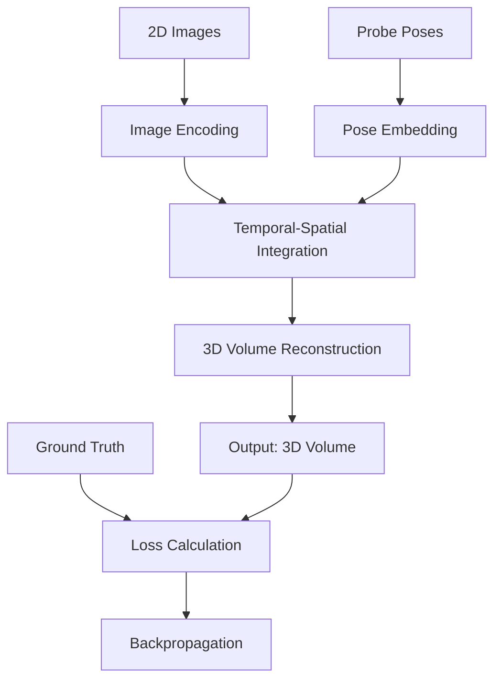
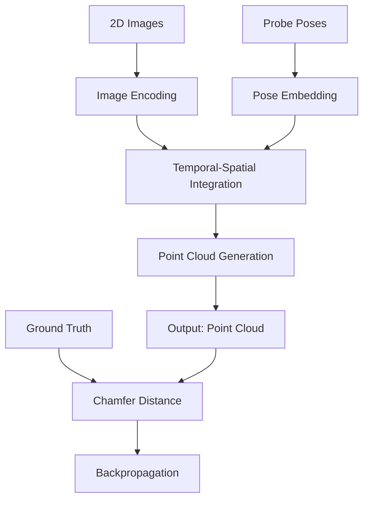
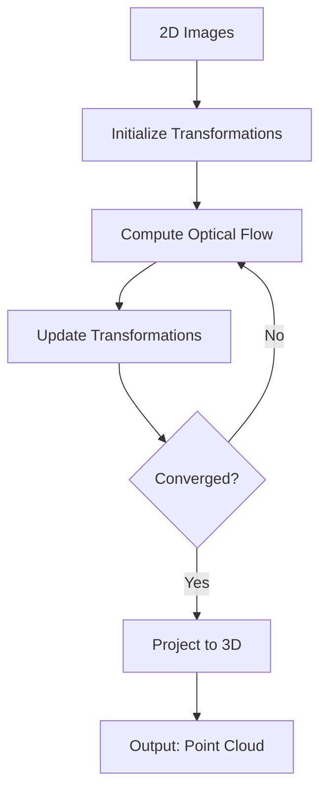

# Summary of 3D Ultrasound Reconstruction Approaches

## Givens

Let:

- $I(t): [0, T] \to \mathbb{R}^{H \times W}$ be the 2D grayscale ultrasound image function
- $P(t): [0, T] \to SE(3)$ be the probe pose function
- $\{(I_i, P_i)\}_{i=1}^N$ be the discrete set of image-pose pairs
- $\Omega \subset \mathbb{R}^3$ be the 3D reconstruction space

## Approach 1: Neural Operator for 3D Volume Reconstruction

### Formulation

$\mathcal{G}: (L^2([0, T]; \mathbb{R}^{H \times W}) \times C([0, T]; SE(3))) \to L^2(\Omega; \mathbb{R})$

such that $\mathcal{G}(I, P) = V$, where $V: \Omega \to \mathbb{R}$ is the reconstructed 3D volume.

### Algorithm

1. Encode images: $E_i = \mathcal{E}(I_i)$
2. Embed poses: $Q_i = \mathcal{Q}(P_i)$
3. Integrate: $V = \mathcal{F}(\{E_i, Q_i\}_{i=1}^N)$
4. Minimize: $\mathcal{L} = \alpha \|V - V_{gt}\|_2^2 + \beta (1 - \text{SSIM}(V, V_{gt}))$

### Mermaid Chart

## Approach 2: Neural Operator for Point Cloud Reconstruction

### Formulation

$\mathcal{G}: (L^2([0, T]; \mathbb{R}^{H \times W}) \times C([0, T]; SE(3))) \to \mathcal{P}$

where $\mathcal{P} = \{(x, y, z, i) | (x, y, z) \in \mathbb{R}^3, i \in \mathbb{R}\}$ is the point cloud space.

### Algorithm

1. Encode images: $E_i = \mathcal{E}(I_i)$
2. Embed poses: $Q_i = \mathcal{Q}(P_i)$
3. Generate point cloud: $\{(x_k, y_k, z_k, i_k)\}_{k=1}^K = \mathcal{F}(\{E_i, Q_i\}_{i=1}^N)$
4. Minimize: $\mathcal{L} = d_{Chamfer}(\{(x_k, y_k, z_k, i_k)\}, \{(x_k^{gt}, y_k^{gt}, z_k^{gt}, i_k^{gt})\})$

### Mermaid Chart

## Approach 3: Optical Flow Minimization for Frame Alignment

### Formulation

Find $\{T_i\}_{i=1}^N$, where $T_i \in SE(3)$, such that:

$\arg\min_{\{T_i\}} \sum_{i=1}^{N-1} \|\text{OpticalFlow}(I_i \circ T_i, I_{i+1} \circ T_{i+1})\|_2^2$

subject to $T_1 = I$ (identity transformation)

### Algorithm

1. Initialize $\{T_i\}_{i=1}^N$
2. For each iteration:
   a. Compute optical flow: $F_i = \text{OpticalFlow}(I_i \circ T_i, I_{i+1} \circ T_{i+1})$
   b. Update transformations: $T_i \leftarrow T_i \circ \Delta T_i(F_i)$
   c. Compute loss: $\mathcal{L} = \sum_{i=1}^{N-1} \|F_i\|_2^2$
3. Reconstruct 3D points: $\{(x_k, y_k, z_k, i_k)\} = \text{Project}(\{I_i\}, \{T_i\})$

### Mermaid Chart

