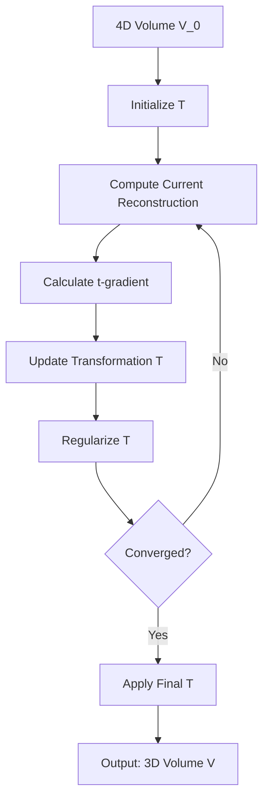

[Previous content remains the same]

## Approach 5: Time as a Spatial Dimension

### Formulation

Let $V_0: \Omega_4 \to \mathbb{R}$ be the initial 4D volume, where $\Omega_4 \subset \mathbb{R}^4$ is a 4D space with coordinates $(x, y, z, t)$.

We aim to find a transformation $T: \Omega_4 \to \Omega_3$ such that:

$V(T(x, y, z, t)) = V_0(x, y, z, t)$

where $V: \Omega_3 \to \mathbb{R}$ is the final 3D reconstructed volume, and $\Omega_3 \subset \mathbb{R}^3$ is the 3D reconstruction space.

### Constraints

1. $T$ should be continuous and invertible (diffeomorphism).
2. $T$ should minimize the variation of $V$ along the $t$ direction in the original space.
3. The Jacobian of $T$ should be well-conditioned to avoid extreme distortions.

### Algorithm

1. Initialize $T$ as the identity transformation in the first three dimensions, discarding $t$: $T_0(x, y, z, t) = (x, y, z)$
2. For each iteration:
   a. Compute the current reconstruction: $V_k(x, y, z) = V_0(T_k^{-1}(x, y, z))$
   b. Calculate the gradient of $V_k$ with respect to the original $t$ coordinate
   c. Update $T_k$ to reduce this gradient: $T_{k+1} = T_k - \lambda \nabla_t V_k \circ T_k^{-1}$
   d. Regularize $T_{k+1}$ to maintain smoothness and invertibility
3. Final reconstruction: $V(x, y, z) = V_0(T^{-1}(x, y, z))$

### Mermaid Chart

### Mathematical Details

We can represent $T$ using a displacement field $u: \Omega_4 \to \mathbb{R}^3$:

$T(x, y, z, t) = (x, y, z) + u(x, y, z, t)$

The optimization problem becomes:

$\min_{u} \int_{\Omega_4} \|\nabla_t V_0(T^{-1}(x, y, z))\|^2 dx dy dz dt + \lambda R(u)$

where $R(u)$ is a regularization term encouraging smoothness and invertibility of $T$.

We can solve this using gradient descent in the space of displacement fields:

$u_{k+1} = u_k - \epsilon (\nabla_t V_k \circ T_k^{-1} + \lambda \nabla R(u_k))$

This formulation allows us to treat time as a spatial dimension initially and then find a transformation that collapses this 4D volume into a consistent 3D reconstruction, effectively aligning the frames in 3D space.
